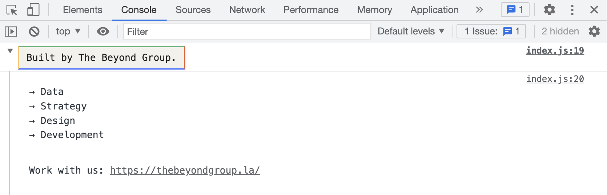

## Brand

The Beyond Group Branding that is shown in the console in the browser developer tools.

### Usage

- Install `yarn add @thebeyondgroup/brand`
- Import `import logBeyondBrand from '@thebeyondgroup/brand'`
- Use `logBeyondBrand()`

```javascript
//main.js
import logBeyondBrand from "@thebeyondgroup/brand";

logBeyondBrand();
```



### Publish

In order to publish this package you must have an NPM account associated with **@thebeyondgroup** organization. Once you have the correct account follow the steps blow.

1.  Build _/dist_ files using `yarn build`
2.  Change version in _package.json_ to the version you want to publish & **save** or use [npm version](https://docs.npmjs.com/cli/v8/commands/npm-version)
3.  Run `npm publish`, which should prompt you to login to your NPM account (the one referred to above). Once you have done, that NPM will publish that package on the NPM registry.
4.  Commit the new version
